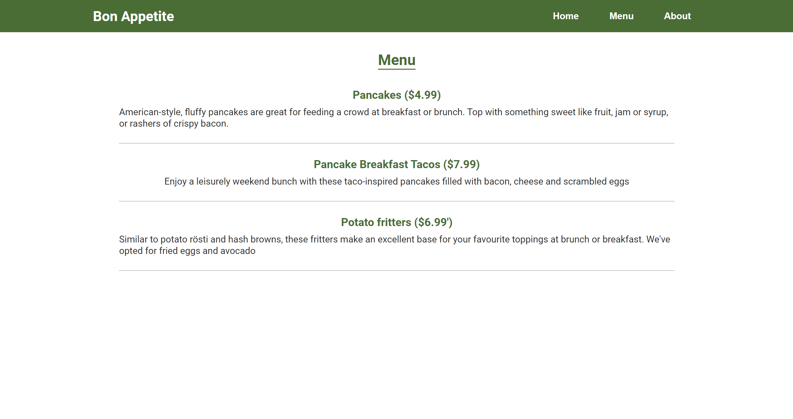

# Restaurant Page

This is a [project](https://www.theodinproject.com/lessons/node-path-javascript-restaurant-page) from "The Odin Project"

We're wanted to create a restaurant webpage where contents are created in the javascript files and to bundle them using Webpack.

